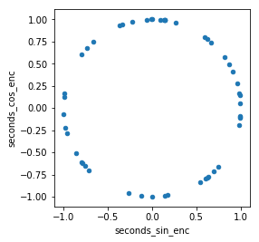

# Label Encoding

## Sin & Cos Encoding
```python
>>> import pandas as pd
>>> import numpy as np
>>> import matplotlib.pyplot as plt
>>> from olo.encoding import sin_cos

>>> def rand_times(n):
>>>     """Generate n rows of random 24-hour times (seconds past midnight)"""
>>>     rand_seconds = np.random.randint(0, 24*60*60, n)
>>>     return pd.DataFrame(data=dict(seconds=rand_seconds))

>>> n_rows = 1000

>>> df = rand_times(n_rows)

>>> df = sin_cos(df)
>>> df.head(2)
   seconds  seconds_sin_enc  seconds_cos_enc
0    80355        -0.424480         0.905437
1    75008        -0.736115         0.676856

>>> df.drop('seconds', axis=1, inplace=True)
>>> df.sample(50).plot.scatter('seconds_sin_enc','seconds_cos_enc').set_aspect('equal')
```


## Frequency Encoding
```python
>>> import pandas as pd
>>> import numpy as np
>>> from olo.encoding import freq_enc

>>> df = pd.DataFrame(np.array(['cat', 'cat', 'dog', 'lion', 'lion', 'lion']),
                      columns=['animal'])
 
>>> df = freq_enc(df, ['animal'])
>>> df
  animal  animal_freq_enc
0    cat         0.333333
1    cat         0.333333
2    dog         0.166667
3   lion         0.500000
4   lion         0.500000
5   lion         0.500000
```

## Feature Hashing
```python
>>> import pandas as pd
>>> import numpy as np
>>> from olo.encoding import hash_enc

>>> np.random.seed(314)
>>> x = np.random.randint(low=100, high=1000, size=4)
>>> x = np.array([hex(i) for i in x])
>>> x
array(['0x26c', '0x2d1', '0x32d', '0x3ba'], dtype='<U5')
 
>>> df = pd.DataFrame(data=x, columns=['feature'])

>>> df = hash_enc(df, ['feature])
>>> df
  feature  feature_hash_enc
0   0x26c            4171
1   0x2d1            1008
2   0x32d            1439
3   0x3ba            4470
```